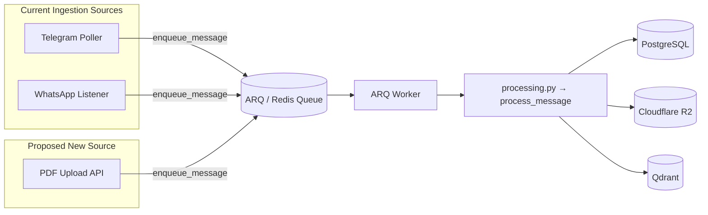
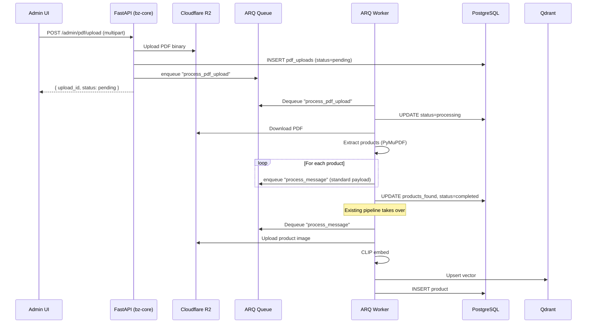

# PDF Catalog Ingestion — Implementation Plan

## Overview

Add a PDF upload feature to the admin UI that extracts products (image + name + price) from wholesale catalog PDFs (80–100 pages, up to 100 MB) and feeds them into the **existing ARQ worker pipeline** — exactly the same path used by Telegram and WhatsApp messages today.

---

## Architecture (Current vs. Proposed)



> [!IMPORTANT]
> The key design decision: PDF extraction produces the **same payload shape** that Telegram/WhatsApp already produce, so `process_message()` in `processing.py` handles everything downstream — no changes needed there.

---

## Payload Contract

Each extracted product from the PDF must produce a payload identical to what Telegram/WhatsApp sends:

```python
{
    "image_b64": "<base64-encoded product image>",  # or None
    "has_image": True,
    "caption": "TZ - Musical Wrist Watch For Kids\nPrice: 170.00 INR",
    "sender_id": None,                  # no sender for PDF uploads
    "chat_id": "pdf_upload:<upload_id>",    # synthetic chat_id
    "chat_title": "Catalog Upload - <filename>",
    "message_id": "<upload_id>_page<N>_item<M>",  # unique per product
    "date": "2026-05-17T14:40:00+00:00",
    "source_platform": "pdf",           # new platform type
}
```

---

## Implementation Phases

### Phase 1: Database Model — `PdfUpload` tracker

**File**: `app/models/pdf_upload.py` *(new)*

Track each uploaded PDF and its processing status.

```python
class PdfUpload(Base):
    __tablename__ = "pdf_uploads"

    id          = UUID, PK, default=uuid4
    filename    = String(500), NOT NULL
    file_key    = Text, NOT NULL          # S3 object key
    file_size   = BigInteger, NOT NULL
    total_pages = Integer, nullable
    status      = String(20), default="pending"
        # pending → processing → completed → failed
    products_found   = Integer, default=0
    products_enqueued = Integer, default=0
    error_message = Text, nullable
    uploaded_by   = UUID, FK → admin_users.id
    created_at    = server_default=now()
    updated_at    = server_default=now(), onupdate=now()
```

**Migration**: Add via Alembic.

---

### Phase 2: Admin API Endpoint — Upload PDF

**File**: `app/api/v1/pdf_admin.py` *(new)*

| Method | Path | Description |
|--------|------|-------------|
| `POST` | `/admin/pdf/upload` | Upload PDF → S3, create `PdfUpload` row, enqueue extraction job |
| `GET`  | `/admin/pdf/uploads` | List all uploads with status |
| `GET`  | `/admin/pdf/uploads/{id}` | Single upload detail |

#### Upload Flow

```python
@router.post("/upload")
async def upload_pdf(
    file: UploadFile,
    db: AsyncSession = Depends(get_db),
    admin = Depends(require_admin),
):
    # 1. Validate: content-type, size <= 100MB, extension .pdf
    # 2. Read file bytes, upload to S3: pdf_uploads/<uuid>.pdf
    # 3. Create PdfUpload row (status="pending")
    # 4. Enqueue ARQ job: "process_pdf_upload" with upload_id
    # 5. Return { upload_id, status, filename }
```

> [!NOTE]
> The PDF binary goes to S3 first, then the ARQ job reads it from S3. This avoids pushing 100 MB through Redis.

**Register in `main.py`**:
```python
from app.api.v1.pdf_admin import router as pdf_admin_router
app.include_router(pdf_admin_router, prefix=prefix)
```

---

### Phase 3: PDF Extraction Service

**File**: `app/services/pdf_extraction.py` *(new)*

This is the core brain. Uses **PyMuPDF (fitz)** to extract images and text from each page.

#### Strategy: Per-Page OCR-Free Extraction

Based on the screenshot, each page has a grid layout with product cards containing:
- An image (embedded in the PDF)
- Product name (text below image)
- Price line: `Price: XXxx.xx INR`
- Optional "Out of stock" text

```python
async def extract_products_from_pdf(upload_id: UUID) -> list[dict]:
    """
    1. Download PDF from S3 to a temp file
    2. Open with fitz (PyMuPDF)
    3. For each page:
       a. Extract all images (fitz page.get_images())
       b. Extract all text blocks with positions (page.get_text("dict"))
       c. Match images to their nearest text blocks by Y-coordinate
       d. Parse product name + price from associated text
       e. Build payload dict for each product
    4. Return list of payloads
    """
```

#### Image–Text Matching Algorithm

```
For each page:
  1. Get all images with their bounding boxes (x0, y0, x1, y1)
  2. Get all text blocks with their bounding boxes
  3. For each image:
     a. Find text blocks whose Y-center is BELOW the image's bottom edge
        and within ±margin of the image's X-center
     b. The closest text block = product name
     c. Look for "Price: NNN.NN INR" pattern in nearby text
     d. Look for "Out of stock" → skip this product
  4. Encode image as base64
  5. Build payload
```

> [!TIP]
> PyMuPDF (`fitz`) is extremely fast — can handle 100-page PDFs in seconds. It extracts embedded images without re-rendering, so no OCR needed for these catalog-style PDFs.

#### Dependencies

```
# Add to pyproject.toml / requirements
PyMuPDF>=1.24.0    # PDF parsing
```

---

### Phase 4: ARQ Task — `process_pdf_upload`

**File**: `app/workers/tasks/process_pdf.py` *(new)*

```python
async def process_pdf_upload(ctx: dict, upload_id: str) -> None:
    """
    ARQ task that:
    1. Loads PdfUpload row, sets status="processing"
    2. Calls extract_products_from_pdf(upload_id)
    3. For each extracted product:
       a. Build the standard message payload
       b. Call enqueue_message(payload, bypass_limits=True)
    4. Updates PdfUpload with products_found, products_enqueued, status
    """
```

**Register in `arq_worker.py`**:
```python
from app.workers.tasks.process_pdf import process_pdf_upload

class WorkerSettings:
    functions = [process_message, process_pdf_upload]
    # ... rest unchanged
```

> [!IMPORTANT]
> The extraction task itself runs as a single ARQ job (long-running, up to 10 min timeout already configured). Each extracted product is then enqueued as a **separate** `process_message` job — leveraging the existing image upload → CLIP embed → dedup → DB persist pipeline.

---

### Phase 5: Processing Compatibility

**File**: `app/services/processing.py` — **Minor changes**

The existing `process_message()` already handles both Telegram and WhatsApp through field normalization. For PDF:

1. **`source_platform = "pdf"`** — already supported by the generic `String(20)` column
2. **`wholesaler_id`** — will be `None` (no sender for PDF uploads), which is already handled
3. **`_extract_price()`** — already works since PDF captions will contain `Price: xxx.xx INR`
4. **`_extract_name()`** — already works, strips price from caption to get name

**Only change needed**: Update `_get_wholesaler_id()` to gracefully handle `source_platform="pdf"` (currently only has `telegram` and `whatsapp` paths). Since `sender_id` will be `None`, it already returns `None` — no change needed.

> [!NOTE]
> **No changes needed in `processing.py`!** The existing pipeline handles PDF payloads natively because they use the same shape.

---

## File Change Summary

| File | Action | Description |
|------|--------|-------------|
| `app/models/pdf_upload.py` | **NEW** | `PdfUpload` model to track uploads |
| `app/models/__init__.py` | EDIT | Register new model |
| `app/api/v1/pdf_admin.py` | **NEW** | Upload, list, detail endpoints |
| `app/services/pdf_extraction.py` | **NEW** | PyMuPDF extraction logic |
| `app/workers/tasks/process_pdf.py` | **NEW** | ARQ task wrapper |
| `app/workers/arq_worker.py` | EDIT | Register `process_pdf_upload` task |
| `app/main.py` | EDIT | Include `pdf_admin_router` |
| `alembic/versions/xxx_add_pdf_uploads.py` | **NEW** | Migration for `pdf_uploads` table |
| `pyproject.toml` / `requirements.txt` | EDIT | Add `PyMuPDF` dependency |

---

## Data Flow (End-to-End)



---

## Edge Cases & Considerations

| Concern | Approach |
|---------|----------|
| **100 MB upload** | Stream to S3 first, process async via ARQ — never hold in memory at the API layer |
| **100 pages × 12 products = 1200 products** | Each enqueued as separate `process_message` job; ARQ handles concurrency (max_jobs=10) |
| **Duplicate products across uploads** | Existing CLIP dedup catches visually identical products (cosine > 0.96) |
| **Out-of-stock items** | Detect `"Out of stock"` text near product during extraction → skip |
| **Images without text** | Skip products where no name/price text can be associated |
| **PDF with scanned pages (raster-only)** | Phase 1 targets embedded-image PDFs (like the screenshot). OCR support can be added later with `pytesseract` if needed |
| **Corrupted/password-protected PDFs** | Catch exceptions, mark upload as `failed` with error message |
| **Progress tracking** | Admin can poll `GET /admin/pdf/uploads/{id}` to see `products_found`/`products_enqueued` counts |

---

## Estimated Effort

| Phase | Effort |
|-------|--------|
| Phase 1: DB model + migration | ~15 min |
| Phase 2: Admin API endpoint | ~30 min |
| Phase 3: PDF extraction service | ~1.5 hr (core complexity) |
| Phase 4: ARQ task wiring | ~15 min |
| Phase 5: Testing & polish | ~30 min |
| **Total** | **~3 hours** |

---

## Ready to implement?

This plan reuses 100% of the existing processing pipeline. The only truly new code is the PDF extraction logic (Phase 3). Everything else is plumbing that follows the exact patterns established by Telegram and WhatsApp ingestion.
